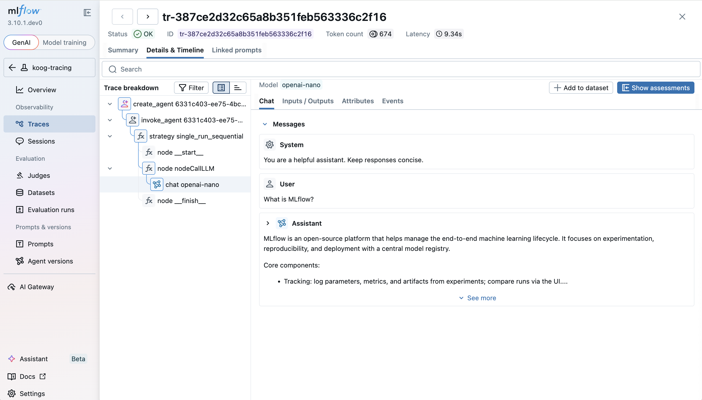

# MLflow Export

Koog supports exporting agent traces to [MLflow](https://mlflow.org/), an open-source platform for agent engineering
with built-in observability, evaluation, prompt management, and monitoring. With MLflow integration, you can visualize,
analyze, and debug how your Koog agents interact with LLMs, tools, and other components.

MLflow natively ingests OpenTelemetry traces via its OTLP HTTP endpoint, so no additional adapters are needed.
You can use the standard `OtlpHttpSpanExporter` from the `opentelemetry-java` SDK.

For background on Koog's OpenTelemetry support, see the [OpenTelemetry support](https://docs.koog.ai/opentelemetry-support/).

---

## Setup instructions

Start the MLflow Tracking Server using [uv](https://docs.astral.sh/uv/):

```bash
uvx mlflow server --port 5000
```

After starting the server, you can access the MLflow UI at `http://localhost:5000`.

!!! tip
    If you don't have a Python environment set up, MLflow also provides a **Docker** option that bundles MLflow
    with PostgreSQL and MinIO, as well as managed services such as **Databricks** and **AWS SageMaker**. See the
    [MLflow server setup guide](https://mlflow.org/docs/latest/genai/getting-started/connect-environment/) for
    all available options.

!!! note
    MLflow requires a SQL-based backend store for OpenTelemetry trace ingestion. By default, `mlflow server` uses
    SQLite, which works out of the box. For production use, you can configure PostgreSQL, MySQL, or MSSQL as
    described in the [MLflow backend store documentation](https://mlflow.org/docs/latest/self-hosting/architecture/backend-store).

## Configuration

To enable MLflow export, install the **OpenTelemetry feature** and add an `OtlpHttpSpanExporter` pointing to the
MLflow server's OTLP endpoint. Include the `x-mlflow-experiment-id` header to associate traces with a specific
experiment.

### Example: agent with MLflow tracing

<!--- INCLUDE
import ai.koog.agents.core.agent.AIAgent
import ai.koog.agents.features.opentelemetry.feature.OpenTelemetry
import ai.koog.prompt.executor.clients.openai.OpenAIModels
import ai.koog.prompt.executor.llms.all.simpleOpenAIExecutor
import io.opentelemetry.exporter.otlp.http.trace.OtlpHttpSpanExporter
import kotlinx.coroutines.runBlocking
-->
```kotlin
fun main() = runBlocking {
    val apiKey = "api-key"

    val agent = AIAgent(
        promptExecutor = simpleOpenAIExecutor(apiKey),
        llmModel = OpenAIModels.Chat.GPT4oMini,
        systemPrompt = "You are a code assistant. Provide concise code examples."
    ) {
        install(OpenTelemetry) {
            addSpanExporter(
                OtlpHttpSpanExporter.builder()
                    .setEndpoint("http://localhost:5000/v1/traces")
                    .addHeader("x-mlflow-experiment-id", "0")
                    .build()
            )
        }
    }

    println("Running agent with MLflow tracing")

    val result = agent.run("Tell me a joke about programming")

    println("Result: $result\nSee traces at http://localhost:5000")
}
```
<!--- KNIT example-mlflow-exporter-01.kt -->

The `x-mlflow-experiment-id` header specifies which MLflow experiment to associate traces with. Use `0` for the
default experiment, or create a new experiment:

```bash
mlflow experiments create --experiment-name "koog-agent-traces"
```

### Example: agent with service info and verbose tracing

<!--- INCLUDE
import ai.koog.agents.core.agent.AIAgent
import ai.koog.agents.features.opentelemetry.feature.OpenTelemetry
import ai.koog.prompt.executor.clients.openai.OpenAIModels
import ai.koog.prompt.executor.llms.all.simpleOpenAIExecutor
import io.opentelemetry.exporter.otlp.http.trace.OtlpHttpSpanExporter
import kotlinx.coroutines.runBlocking
-->
```kotlin
fun main() = runBlocking {
    val apiKey = "api-key"

    val agent = AIAgent(
        promptExecutor = simpleOpenAIExecutor(apiKey),
        llmModel = OpenAIModels.Chat.GPT4oMini,
        systemPrompt = "You are a helpful assistant."
    ) {
        install(OpenTelemetry) {
            setServiceInfo("koog-agent", "1.0.0")
            setVerbose(true)

            addSpanExporter(
                OtlpHttpSpanExporter.builder()
                    .setEndpoint("http://localhost:5000/v1/traces")
                    .addHeader("x-mlflow-experiment-id", "0")
                    .build()
            )
        }
    }

    agent.run("What is Kotlin?")
    agent.run("Show me a coroutine example")
}
```
<!--- KNIT example-mlflow-exporter-02.kt -->

## What gets traced

When enabled, the MLflow export captures the same spans as Koog's general OpenTelemetry integration, including:

- **Agent lifecycle events**: agent start, stop, errors
- **LLM interactions**: prompts, responses, token usage, latency
- **Tool calls**: execution traces for tool invocations
- **System context**: metadata such as model name, environment, Koog version

For security reasons, some content of OpenTelemetry spans is masked by default.
To make the content available in MLflow, use the [setVerbose](opentelemetry-support.md#setverbose) method in the OpenTelemetry configuration and set its `verbose` argument to `true`.

After running the agent, open the MLflow UI at `http://localhost:5000` and navigate to the **Traces** tab to view
detailed traces showing agent execution spans, LLM calls, and tool executions.

When visualized in MLflow, the trace appears as follows:


For more details on MLflow tracing, see:
[MLflow Tracing documentation](https://mlflow.org/docs/latest/genai/tracing/) and the
[MLflow Koog integration guide](https://mlflow.org/docs/latest/genai/tracing/integrations/listing/koog).

---

## Troubleshooting

### No traces appear in MLflow
- Ensure the MLflow server is running and accessible at the configured endpoint.
- Verify that `mlflow server` was started with the default SQLite backend (or another SQL-based store). File-based storage does not support OpenTelemetry trace ingestion.
- Make sure the `OTEL_SDK_DISABLED` environment variable is not set to `true`.

### Missing span content
- By default, Koog masks span content for security. Set `setVerbose(true)` in the OpenTelemetry configuration to include full prompts and responses.

### Connection refused errors
- Confirm the MLflow server port matches the endpoint configured in `OtlpHttpSpanExporter`.
- Check that no firewall rules block the connection to the MLflow server.
